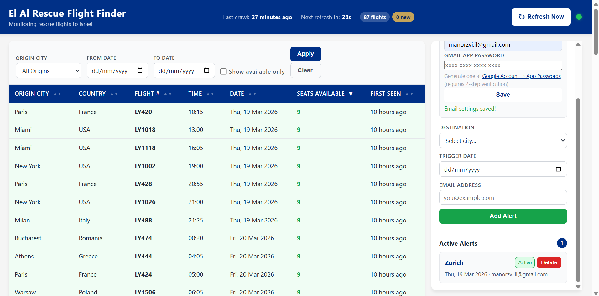
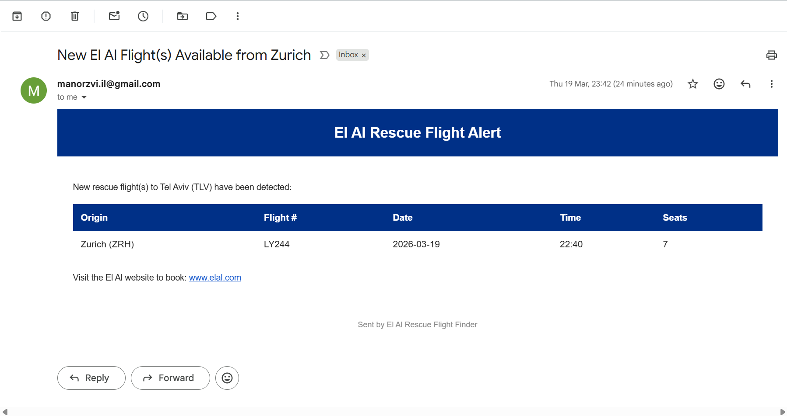

# El Al Rescue Flight Finder

A Windows desktop application that monitors El Al's website for available rescue and recovery flights **to Israel**, aggregates them in a real-time dashboard, and sends email alerts when seats become available from your chosen origin cities.

Built during **Operation "Roaring Lion"** (March 2026), when Ben Gurion Airport operated at ~20% capacity and regular El Al flights were canceled through March 28. Thousands of Israelis abroad needed a reliable way to find available flights home.



## Features

- **Real-time flight monitoring** - Automatically crawls El Al's seat availability data every hour using headless Chromium
- **22+ origin cities** - Tracks flights from New York, London, Paris, Bangkok, Zurich, Rome, and more
- **Seat availability tracking** - Shows exact seat counts per flight per date (updated hourly)
- **Email alerts** - Get notified instantly when seats become available on flights from your chosen cities
- **Sortable & filterable table** - Sort by any column, filter by origin city, date range, or available seats only
- **News monitoring** - Tracks El Al's operational updates, non-operational destinations, and recovery flight origins
- **System tray app** - Runs quietly in the background with quick access to the dashboard
- **Offline persistence** - SQLite database preserves all data between sessions

## Installation

### Prerequisites

- **Python 3.11+** - [Download](https://www.python.org/downloads/)
- **Google Chrome or Chromium** - Required for Playwright browser automation

### Setup

```bash
# Clone the repository
git clone https://github.com/ManorZ/ElAlRescueFlightFinder.git
cd ElAlRescueFlightFinder

# Create virtual environment
python -m venv venv

# Activate it
# Windows:
venv\Scripts\activate
# Linux/Mac:
source venv/bin/activate

# Install dependencies
pip install -r requirements.txt

# Install Chromium for Playwright (required for crawling)
python -m playwright install chromium
```

## Configuration

### Email Alerts (Optional)

To receive email notifications when flights become available, you need a Gmail account with an **App Password**:

1. Enable [2-Step Verification](https://myaccount.google.com/security) on your Google account
2. Generate an [App Password](https://myaccount.google.com/apppasswords) (select "Mail" as the app)
3. You can configure email directly in the dashboard UI, or edit the `.env` file:

```env
SMTP_USERNAME=youremail@gmail.com
SMTP_PASSWORD=xxxx xxxx xxxx xxxx
```

### Other Settings

Create a `.env` file in the project root (or edit the existing one):

```env
# Email Configuration
SMTP_SERVER=smtp.gmail.com
SMTP_PORT=587
SMTP_USERNAME=
SMTP_PASSWORD=
EMAIL_FROM=

# Application Settings
POLL_INTERVAL_MINUTES=60        # How often to check for new flights
NEWS_POLL_INTERVAL_MINUTES=30   # How often to check news updates
FLASK_PORT=5000                 # Dashboard port
```

## Usage

### Start the Application

```bash
python app.py
```

Or on Windows, double-click `run.bat`.

The app will:
1. Initialize the database
2. Fetch the latest flight data from El Al (takes ~10 seconds)
3. Open the dashboard in your browser at `http://localhost:5000`
4. Start the system tray icon
5. Continue crawling in the background every hour

### Dashboard

The dashboard shows all El Al flights **to Israel** for the next 8 days:

- **Green rows** - Seats available
- **Red "0"** - Sold out
- **Yellow highlight** - Newly discovered flights

Use the filters at the top to narrow down by origin city, date range, or show only flights with available seats.

### Setting Up Alerts

1. In the right sidebar, configure your email under **Email Settings** if you haven't already
2. Select a **Destination** (the city you want to fly FROM)
3. Pick a **Trigger Date** (you'll be alerted for flights on or after this date)
4. Enter your **Email Address**
5. Click **Add Alert**

You'll receive an email immediately if matching flights with available seats already exist, and again whenever new availability appears during hourly crawls.



### System Tray

The app runs in the Windows system tray with these options:
- **Open Dashboard** - Opens the web dashboard in your browser
- **Refresh Now** - Triggers an immediate data refresh
- **Quit** - Stops the application

## How It Works

```
Every 60 minutes:
  1. Launch headless Chromium browser
  2. Navigate to elal.com/eng/seat-availability
  3. Intercept the SeatAvailability API response
  4. Parse flights TO Israel (22 origin cities, 8-day window)
  5. Store/update in SQLite database
  6. Check new flights against user alerts
  7. Send email for matches with available seats
  8. Update dashboard via auto-refresh
```

The El Al API has bot protection that blocks regular HTTP requests. The app uses **Playwright** (headless Chromium) to load the page like a normal browser, then intercepts the API response from network traffic.

## Tech Stack

| Component | Technology |
|-----------|-----------|
| Backend | Python 3.11+, Flask |
| Crawler | Playwright (headless Chromium) |
| Database | SQLite with WAL mode |
| Scheduler | APScheduler |
| Email | Gmail SMTP with App Password |
| Frontend | Vanilla HTML/CSS/JavaScript |
| System Tray | pystray + Pillow |

## Project Structure

```
ElAlRescueFlightFinder/
├── app.py                    # Main entry point
├── config.py                 # Settings from .env
├── database.py               # SQLite schema & connections
├── models.py                 # Data classes
├── scheduler.py              # Hourly crawl scheduling
├── tray_app.py               # Windows system tray
├── crawler/
│   ├── seat_availability.py  # Playwright-based flight crawler
│   └── news_monitor.py       # News page monitor
├── services/
│   └── email_notifier.py     # Email alert sender
├── web/
│   ├── routes.py             # Flask API (13 endpoints)
│   ├── templates/index.html  # Dashboard HTML
│   └── static/               # CSS & JavaScript
├── data/
│   └── flights.db            # SQLite database (auto-created)
├── requirements.txt
├── run.bat                   # Windows launcher
└── .env                      # Your settings (not in git)
```

## License

This project was built as an emergency tool during a crisis. Use it freely.

## Acknowledgments

Built with the help of [Claude Code](https://claude.ai/claude-code) by Anthropic.
